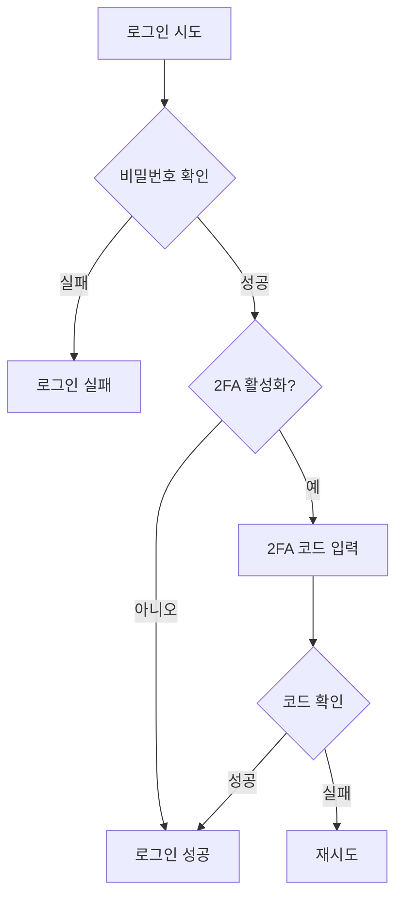

# 2차 인증(2FA) 시스템 문서

## 목차
1. [개요](#개요)
2. [설치 및 설정](#설치-및-설정)
3. [사용자 가이드](#사용자-가이드)
4. [관리자 가이드](#관리자-가이드)
5. [개발자 가이드](#개발자-가이드)
6. [API 참조](#api-참조)
7. [문제 해결](#문제-해결)

## 개요

@jiny/admin의 2차 인증(Two-Factor Authentication, 2FA) 시스템은 Google Authenticator를 기반으로 한 TOTP(Time-based One-Time Password) 방식의 추가 보안 계층을 제공합니다.

### 주요 특징
- 📱 **Google Authenticator 지원**: 업계 표준 TOTP 알고리즘
- 🔄 **백업 코드**: 장치 분실 시 복구 옵션
- 🎯 **선택적 적용**: 사용자별 활성화/비활성화
- 📊 **모니터링**: 2FA 사용 현황 추적

### 보안 이점
- 비밀번호 유출 시에도 계정 보호
- 피싱 공격 방어
- 규정 준수 (PCI DSS, HIPAA 등)

## 설치 및 설정

### 1. 필수 패키지 설치
```bash
composer require pragmarx/google2fa
composer require simplesoftwareio/simple-qrcode
```

### 2. 마이그레이션 실행
```bash
php artisan migrate
```

적용되는 컬럼:
- `two_factor_secret`: 암호화된 비밀 키
- `two_factor_recovery_codes`: 복구 코드
- `two_factor_confirmed_at`: 설정 완료 시각
- `two_factor_enabled`: 활성화 상태
- `last_2fa_used_at`: 마지막 사용 시각

### 3. 환경 설정
`.env` 파일:
```env
# 2FA 설정
TWO_FACTOR_ENABLED=true
TWO_FACTOR_RECOVERY_CODES=8
TWO_FACTOR_QR_SIZE=200
```

## 사용자 가이드

### 2FA 설정 방법

#### 1단계: 2FA 페이지 접속
```
/admin/user/2fa
```

#### 2단계: 2FA 활성화
1. "2FA 설정" 버튼 클릭
2. 현재 비밀번호 입력
3. QR 코드 스캔 또는 수동 입력

#### 3단계: 앱 설정
**Google Authenticator 앱에서:**
1. "+" 버튼 탭
2. "QR 코드 스캔" 선택
3. 화면의 QR 코드 스캔

**수동 입력:**
1. "수동으로 입력" 선택
2. 계정: `your-email@example.com`
3. 키: `XXXX-XXXX-XXXX-XXXX`

#### 4단계: 확인
1. 앱에 표시된 6자리 코드 입력
2. "확인" 버튼 클릭
3. 복구 코드 안전하게 보관

### 로그인 과정

#### 2FA 활성화된 경우:
1. 이메일/비밀번호 입력
2. 2FA 코드 입력 페이지로 자동 이동
3. Google Authenticator 앱 열기
4. 6자리 코드 입력
5. 로그인 완료

### 복구 코드 사용

#### 장치를 분실한 경우:
1. 로그인 페이지에서 이메일/비밀번호 입력
2. 2FA 코드 입력 화면에서 "복구 코드 사용" 클릭
3. 저장해둔 복구 코드 중 하나 입력
4. 로그인 후 새 장치 설정 권장

⚠️ **주의**: 각 복구 코드는 1회만 사용 가능

## 관리자 가이드

### 2FA 관리 페이지
```
/admin/user/2fa
```

### 관리 기능

#### 1. 사용자 2FA 상태 확인
- 전체 사용자 2FA 활성화 현황
- 마지막 사용 시간
- 설정 완료 여부

#### 2. 강제 비활성화
```php
// 특정 사용자 2FA 비활성화
$user = User::find($userId);
$user->two_factor_enabled = false;
$user->two_factor_secret = null;
$user->two_factor_recovery_codes = null;
$user->save();
```

#### 3. 사용 통계
- `/admin/user/stats`에서 2FA 사용 통계 확인
- 로그인 방법별 분석
- 2FA 채택률

### 정책 설정

#### 2FA 필수 적용 (선택사항)
```php
// AdminAuthController.php
public function login(Request $request)
{
    // 2FA 필수 체크
    if (!$user->two_factor_enabled) {
        return redirect()->route('admin.user.2fa.setup')
            ->with('warning', '2FA 설정이 필요합니다.');
    }
}
```

#### 특정 역할에만 적용
```php
// 관리자만 2FA 필수
if ($user->isAdmin && !$user->two_factor_enabled) {
    // 2FA 설정 강제
}
```

## 개발자 가이드

### 아키텍처

#### 주요 컴포넌트
1. **Admin2FAController**: 2FA 인증 처리
2. **AdminUser2fa Controllers**: 2FA 관리 CRUD
3. **Google2FA Package**: TOTP 알고리즘 구현
4. **QrCode Package**: QR 코드 생성

### 인증 플로우



### 코드 구조

#### 2FA 설정 저장
```php
use PragmaRX\Google2FA\Google2FA;

class AdminUser2faEdit extends Controller
{
    public function enable(Request $request, $id)
    {
        $google2fa = new Google2FA();
        
        // 비밀 키 생성
        $secret = $google2fa->generateSecretKey();
        
        // QR 코드 URL 생성
        $qrCodeUrl = $google2fa->getQRCodeUrl(
            config('app.name'),
            $user->email,
            $secret
        );
        
        // 사용자에 저장
        $user->two_factor_secret = encrypt($secret);
        $user->two_factor_recovery_codes = $this->generateRecoveryCodes();
        $user->save();
    }
}
```

#### 2FA 검증
```php
public function verify(Request $request)
{
    $google2fa = new Google2FA();
    $user = User::find($request->session()->get('2fa_user_id'));
    
    $valid = $google2fa->verifyKey(
        decrypt($user->two_factor_secret),
        $request->input('code')
    );
    
    if ($valid) {
        Auth::login($user);
        return redirect()->intended(route('admin.dashboard'));
    }
    
    return back()->withErrors(['code' => '잘못된 코드입니다.']);
}
```

### 세션 관리

#### 2FA 임시 세션
```php
// 2FA 대기 중 세션 데이터
session([
    '2fa_user_id' => $user->id,
    '2fa_user_email' => $user->email,
    '2fa_attempts' => 0,
    '2fa_remember' => $request->boolean('remember')
]);
```

#### 세션 정리
```php
// 2FA 완료 후
$request->session()->forget([
    '2fa_user_id',
    '2fa_user_email', 
    '2fa_attempts',
    '2fa_remember'
]);
```

## API 참조

### Routes

| 메서드 | 경로 | 설명 |
|--------|------|------|
| GET | `/admin/user/2fa` | 2FA 관리 목록 |
| GET | `/admin/user/2fa/{id}` | 2FA 상세 정보 |
| GET | `/admin/user/2fa/{id}/edit` | 2FA 설정 페이지 |
| POST | `/admin/user/2fa/{id}/setup` | 2FA 설정 시작 |
| POST | `/admin/user/2fa/{id}/confirm` | 2FA 설정 확인 |
| POST | `/admin/user/2fa/{id}/disable` | 2FA 비활성화 |
| DELETE | `/admin/user/2fa/{id}/force-disable` | 강제 비활성화 |
| GET | `/admin/login/2fa/challenge` | 2FA 코드 입력 |
| POST | `/admin/login/2fa/verify` | 2FA 코드 검증 |

### 모델 속성

#### User 모델
```php
class User extends Authenticatable
{
    protected $casts = [
        'two_factor_recovery_codes' => 'array',
        'two_factor_confirmed_at' => 'datetime',
        'two_factor_enabled' => 'boolean',
        'last_2fa_used_at' => 'datetime',
    ];
    
    protected $hidden = [
        'two_factor_secret',
        'two_factor_recovery_codes',
    ];
}
```

### Helper 함수

```php
// 2FA 활성화 확인
if (Admin2FAController::check2FARequired($user, $request)) {
    // 2FA 필요
}

// 복구 코드 생성
$codes = Admin2FAController::generateRecoveryCodes();

// QR 코드 생성
$qrCode = Admin2FAController::generateQrCode($user);
```

## 문제 해결

### 일반적인 문제

#### Q: QR 코드가 표시되지 않음
**A:** QR 코드 패키지 확인
```bash
composer require simplesoftwareio/simple-qrcode
php artisan vendor:publish --provider="SimpleSoftwareIO\QrCode\QrCodeServiceProvider"
```

#### Q: "시간이 맞지 않습니다" 오류
**A:** 서버와 장치 시간 동기화
```bash
# 서버 시간 확인
date

# NTP 동기화
sudo ntpdate -s time.nist.gov
```

#### Q: 복구 코드를 모두 사용함
**A:** 관리자가 2FA 재설정
```php
// 관리자 콘솔에서
$user = User::find($userId);
$user->two_factor_recovery_codes = Admin2FAController::generateRecoveryCodes();
$user->save();
```

#### Q: Google Authenticator 외 다른 앱 사용?
**A:** TOTP 표준 지원 앱 모두 가능
- Microsoft Authenticator
- Authy
- 1Password
- LastPass Authenticator

### 보안 고려사항

#### 1. 비밀 키 보호
```php
// 항상 암호화하여 저장
$user->two_factor_secret = encrypt($secret);

// 복호화하여 사용
$secret = decrypt($user->two_factor_secret);
```

#### 2. 시간 창 설정
```php
// 30초 시간 창 (기본값)
$google2fa->setWindow(1); // 앞뒤 30초 허용
```

#### 3. 재사용 방지
```php
// 같은 코드 재사용 방지
if ($user->last_2fa_code === $code && 
    $user->last_2fa_used_at->gt(now()->subSeconds(90))) {
    return false; // 재사용 거부
}
```

### 로그 및 모니터링

#### 2FA 이벤트 로깅
```php
// 2FA 설정
AdminUserLog::log('2fa_enabled', $user);

// 2FA 사용
AdminUserLog::log('2fa_verified', $user);

// 2FA 실패
AdminUserLog::log('2fa_failed', $user);

// 복구 코드 사용
AdminUserLog::log('2fa_recovery_used', $user);
```

#### 모니터링 지표
- 2FA 채택률
- 평균 검증 시간
- 실패율
- 복구 코드 사용 빈도

## 규정 준수

### PCI DSS
- 8.3.4: 강력한 인증 메커니즘 구현 ✓
- 8.3.5: 개인별 고유 인증 ✓

### NIST 800-63B
- AAL2 (Authenticator Assurance Level 2) 준수
- 다중 요소 인증 구현

## 업데이트 내역

### v1.0.0 (2025-09-02)
- 초기 릴리스
- Google Authenticator 통합
- 복구 코드 시스템
- 관리자 인터페이스

## 로드맵

### 계획된 기능
- [ ] SMS 기반 2FA 옵션
- [ ] 하드웨어 키 (YubiKey) 지원
- [ ] 생체 인증 통합
- [ ] 신뢰할 수 있는 장치 관리

## 라이선스

이 시스템은 @jiny/admin 패키지의 일부로 제공됩니다.

## 지원

- GitHub: [jiny/admin](https://github.com/jiny/admin)
- 문서: [jiny.dev/docs](https://jiny.dev/docs)
- 이메일: support@jiny.dev