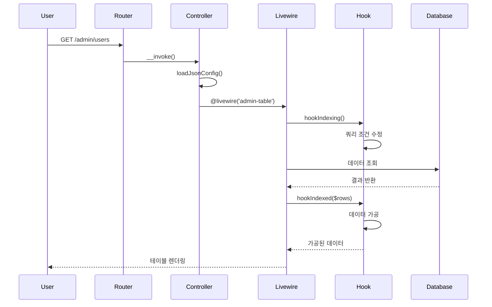
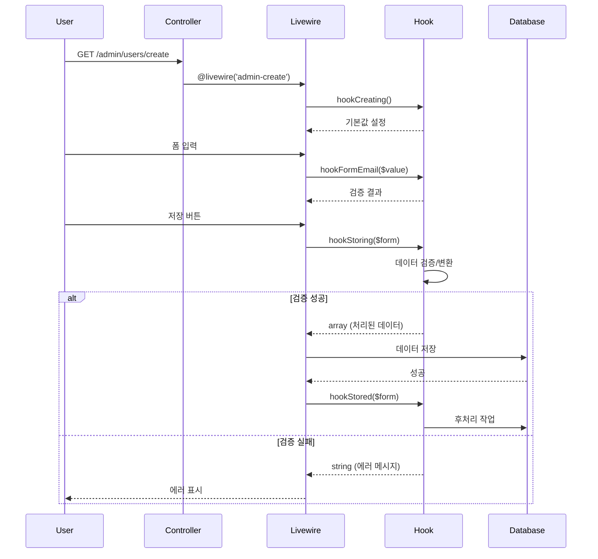

# Admin 컨트롤러 생성 규칙 및 구조

## 📌 개요

@jiny/admin 패키지의 컨트롤러는 Laravel의 Single Action Controller 패턴을 기반으로 하며, JSON 설정과 Hook 시스템을 통해 유연한 커스터마이징을 제공합니다.

## 🎯 핵심 설계 원칙

### 1. Single Action Controller
모든 컨트롤러는 `__invoke()` 메소드만을 가지는 Single Action Controller로 구현됩니다.

```php
class AdminUsers extends Controller
{
    public function __invoke(Request $request)
    {
        // 단일 책임을 가진 컨트롤러
        return view($this->jsonData['template']['index'], [
            'jsonData' => $this->jsonData
        ]);
    }
}
```

**장점:**
- 단일 책임 원칙(SRP) 준수
- 라우트 정의가 명확
- 테스트가 용이
- 컨트롤러 분리로 유지보수 향상

### 2. JSON 설정 분리
컨트롤러의 동작 설정을 하드코딩하지 않고 별도의 JSON 파일로 분리합니다.

```json
// AdminUsers.json
{
    "model": "User",
    "route": {
        "name": "admin.users",
        "prefix": "admin/users"
    },
    "template": {
        "index": "template.index",
        "create": "template.create",
        "edit": "template.edit"
    },
    "index": {
        "table": {
            "columns": {
                "id": { "label": "ID", "sortable": true },
                "email": { "label": "이메일", "sortable": true },
                "name": { "label": "이름", "sortable": true }
            }
        },
        "pagination": {
            "perPage": 10,
            "perPageOptions": [10, 25, 50, 100]
        }
    }
}
```

**장점:**
- 코드 수정 없이 동작 변경 가능
- 설정 재사용 가능
- 버전 관리 용이

### 3. Template and Include
관리자 페이지는 대부분 유사한 구조를 가지므로 템플릿을 사용합니다.

```blade
{{-- template/index.blade.php --}}
<x-admin-layout>
    {{-- 공통 헤더 --}}
    @livewire('admin-header-with-settings')
    
    {{-- 페이지별 컨텐츠 --}}
    @include($jsonData['view']['index'] ?? 'admin.admin_users.table')
    
    {{-- 공통 푸터 --}}
    @livewire('admin-footer')
</x-admin-layout>
```

## 🔧 Livewire3 컴포넌트 통합

공통된 기능을 Livewire3 컴포넌트로 분리하여 재사용성을 높입니다.

### 주요 Livewire 컴포넌트

```php
// AdminTable.php - 테이블 표시 컴포넌트
class AdminTable extends Component
{
    public function render()
    {
        $rows = $this->getRows();
        
        // 컨트롤러 Hook 호출
        if ($this->controller && method_exists($this->controller, 'hookIndexed')) {
            $rows = $this->controller->hookIndexed($this, $rows);
        }
        
        return view('livewire.admin-table', ['rows' => $rows]);
    }
}
```

### 컴포넌트 구조
- `AdminTable`: 데이터 테이블 표시 및 관리
- `AdminCreate`: 생성 폼 처리
- `AdminEdit`: 수정 폼 처리
- `AdminDelete`: 삭제 확인 및 처리
- `AdminShow`: 상세 정보 표시
- `AdminSearch`: 검색 인터페이스

## 🪝 Hook 시스템 통합

3가지 종류의 Hook 시스템을 통해 컨트롤러에서 Livewire 컴포넌트의 동작을 제어합니다.

### 1. CRUD 라이프사이클 Hook

데이터 처리의 각 단계에서 호출되는 Hook입니다.

```php
class AdminUsersCreate extends Controller
{
    /**
     * 생성 폼 초기화 시 호출
     */
    public function hookCreating($wire, $value)
    {
        // 사용자 타입 목록 조회
        $userTypes = DB::table('admin_user_types')->get();
        $wire->userTypes = $userTypes;
        
        return array_merge(['isAdmin' => false], $value);
    }
    
    /**
     * 데이터 저장 전 호출
     */
    public function hookStoring($wire, $form)
    {
        // 패스워드 검증
        if (!$this->validatePassword($form['password'])) {
            return "패스워드 검증 실패"; // 문자열 반환 시 에러
        }
        
        // 패스워드 암호화
        $form['password'] = Hash::make($form['password']);
        return $form; // 배열 반환 시 정상 진행
    }
    
    /**
     * 데이터 저장 후 호출
     */
    public function hookStored($wire, $form)
    {
        // 사용자 타입 카운터 증가
        DB::table('admin_user_types')
            ->where('code', $form['utype'])
            ->increment('user_count');
            
        return $form;
    }
}
```

#### 라이프사이클 Hook 목록

| Hook 메소드 | 호출 시점 | 용도 |
|------------|---------|------|
| `hookIndexing()` | 목록 조회 전 | 쿼리 조건 수정 |
| `hookIndexed()` | 목록 조회 후 | 데이터 가공 |
| `hookCreating()` | 생성 폼 표시 | 기본값 설정 |
| `hookStoring()` | 생성 데이터 저장 전 | 데이터 검증/변환 |
| `hookStored()` | 생성 데이터 저장 후 | 후처리 작업 |
| `hookEditing()` | 수정 폼 표시 | 데이터 준비 |
| `hookUpdating()` | 수정 데이터 저장 전 | 데이터 검증/변환 |
| `hookUpdated()` | 수정 데이터 저장 후 | 후처리 작업 |
| `hookDeleting()` | 삭제 전 | 삭제 가능 여부 체크 |
| `hookDeleted()` | 삭제 후 | 관련 데이터 정리 |

### 2. Form Update Hook

폼 필드가 실시간으로 변경될 때 호출되는 Hook입니다.

```php
class AdminUsersCreate extends Controller
{
    /**
     * 이메일 필드 변경 시 호출
     */
    public function hookFormEmail($wire, $value, $fieldName = 'email')
    {
        // 이메일 형식 검증
        if (!filter_var($value, FILTER_VALIDATE_EMAIL)) {
            $wire->addError('form.email', '올바른 이메일 형식이 아닙니다.');
            return;
        }
        
        // 중복 체크
        $exists = DB::table('users')->where('email', $value)->exists();
        if ($exists) {
            $wire->addError('form.email', '이미 등록된 이메일입니다.');
        } else {
            $wire->resetErrorBag('form.email');
        }
    }
    
    /**
     * 패스워드 필드 변경 시 호출
     */
    public function hookFormPassword($wire, $value, $fieldName = 'password')
    {
        $validator = new PasswordValidator();
        
        if (!$validator->validate($value)) {
            $errors = $validator->getErrors();
            $wire->addError('form.password', $errors[0]);
        } else {
            $wire->resetErrorBag('form.password');
        }
    }
}
```

#### Form Hook 패턴
- 메소드명: `hookForm{FieldName}()`
- 실시간 검증에 사용
- 에러 메시지 즉시 표시
- 사용자 경험 향상

### 3. Custom Hook

특정 기능을 위한 커스텀 Hook입니다.

```php
class AdminUsersShow extends Controller
{
    /**
     * 비밀번호 강제 변경 Hook
     */
    public function hookForcePasswordChange($wire, $userId)
    {
        try {
            $user = User::findOrFail($userId);
            $user->password_change_required = true;
            $user->save();
            
            return ['success' => true, 'message' => '비밀번호 변경 요청 완료'];
        } catch (\Exception $e) {
            return ['success' => false, 'message' => $e->getMessage()];
        }
    }
    
    /**
     * 계정 활성화/비활성화 Hook
     */
    public function hookToggleAccount($wire, $userId, $status)
    {
        $user = User::find($userId);
        $user->is_active = $status;
        $user->save();
        
        // 로그 기록
        AdminUserLog::log($status ? 'account_enabled' : 'account_disabled', $user);
        
        return ['success' => true];
    }
}
```

## 📊 메소드 호출 다이어그램

### 목록 페이지 (Index) 호출 흐름



### 생성 페이지 (Create) 호출 흐름



## 🔍 Hook 반환값 패턴

### 성공/실패 구분 규칙

```php
// 성공: 배열 반환
public function hookStoring($wire, $form)
{
    // 데이터 처리...
    return $form; // array - 성공
}

// 실패: 문자열 반환
public function hookStoring($wire, $form)
{
    if ($error) {
        return "에러 메시지"; // string - 실패
    }
}
```

### Livewire 컴포넌트의 처리

```php
// AdminCreate.php (Livewire Component)
public function save()
{
    // Hook 호출
    $result = $this->controller->hookStoring($this, $this->form);
    
    // 반환값 타입으로 성공/실패 구분
    if (is_string($result)) {
        // 문자열: 에러 처리
        $this->addError('general', $result);
        return;
    }
    
    // 배열: 정상 진행
    $this->form = $result;
    DB::table($this->table)->insert($this->form);
}
```

## 💡 모범 사례

### 1. 컨트롤러 분리
```php
// ✅ 좋은 예: 각 액션별 컨트롤러 분리
AdminUsers.php        // 목록
AdminUsersCreate.php  // 생성
AdminUsersEdit.php    // 수정
AdminUsersDelete.php  // 삭제

// ❌ 나쁜 예: 하나의 컨트롤러에 모든 액션
AdminUsersController.php // index, create, edit, delete...
```

### 2. Hook 메소드 명명 규칙
```php
// ✅ 좋은 예: 명확한 시점 표현
hookIndexing()    // ~ing: 실행 전
hookIndexed()     // ~ed: 실행 후
hookFormEmail()   // Form{Field}: 폼 필드 이벤트

// ❌ 나쁜 예: 모호한 이름
beforeIndex()
handleEmail()
processData()
```

### 3. JSON 설정 구조화
```json
{
    "template": {
        "index": "template.index",
        "create": "template.create"
    },
    "index": {
        "table": { /* 테이블 설정 */ },
        "pagination": { /* 페이지네이션 설정 */ },
        "search": { /* 검색 설정 */ }
    },
    "create": {
        "defaults": { /* 기본값 */ },
        "validation": { /* 검증 규칙 */ }
    }
}
```

## 🐛 디버깅 팁

### Hook 실행 추적
```php
public function hookIndexing($wire, $query)
{
    \Log::info('hookIndexing called', [
        'controller' => get_class($this),
        'user' => auth()->user()->email,
        'timestamp' => now()
    ]);
    
    return $query;
}
```

### JSON 설정 검증
```php
public function __construct()
{
    $this->jsonData = $this->loadJsonConfig();
    
    // 필수 설정 체크
    if (!isset($this->jsonData['template']['index'])) {
        throw new \Exception('template.index 설정이 필요합니다.');
    }
}
```

## 📂 컨트롤러 그룹별 상세 분석

### AdminDashboard - 대시보드
**목적**: 시스템 전체 현황 및 통계를 한눈에 파악

**주요 기능**:
- 사용자 통계 (전체, 관리자, 활성 세션)
- 보안 통계 (2FA 사용률, 차단 IP, 실패 로그인)
- 실시간 활동 모니터링
- 시간별 로그인 트렌드 차트
- 브라우저 사용 통계

### AdminUsers - 사용자 관리
**목적**: 시스템 사용자 계정 전체 CRUD 관리

**컴포넌트별 Hook 메소드**:

#### AdminUsers (목록)
- `hookIndexing()`: 데이터 조회 전 처리
- `hookIndexed()`: admin_user_types 조인으로 사용자 타입명 추가

#### AdminUsersCreate (생성)
- `hookCreating()`: 폼 초기화, user_types 조회
- `hookFormEmail()`: 이메일 실시간 검증
- `hookFormPassword()`: 패스워드 실시간 검증
- `hookStoring()`: 저장 전 처리 (패스워드 해싱)
- `hookStored()`: 저장 후 처리 (user_types 카운트 증가)

#### AdminUsersEdit (수정)
- `hookEditing()`: 폼 초기화, 패스워드 필드 제거
- `hookFormEmail()`: 중복 체크 (자신 제외)
- `hookUpdating()`: 업데이트 전 처리
- `hookUpdated()`: user_types 카운트 조정

#### AdminUsersDelete (삭제)
- `hookDeleting()`: 삭제 가능 여부 체크 (자기 자신, 시스템 관리자 보호)
- `hookDeleted()`: user_types 카운트 감소

#### AdminUsersShow (상세)
**커스텀 액션 Hook**:
```php
hookCustomPasswordResetForce()   // 비밀번호 변경 강제
hookCustomPasswordResetCancel()  // 강제 해제
hookCustomPasswordExpiryExtend() // 만료 기간 연장
hookCustomEmailVerify()          // 이메일 인증
hookCustomAccountActivate()      // 계정 활성화
hookCustomAccountDeactivate()    // 계정 비활성화
```

### AdminPasswordLogs - 비밀번호 로그
**목적**: 비밀번호 관련 모든 활동 추적 및 보안 관리

**주요 기능**:
- 비밀번호 변경 이력 추적
- 실패한 로그인 시도 모니터링
- IP 차단/해제 관리
- 브루트 포스 공격 방지

### AdminSessions - 세션 관리
**목적**: 실시간 세션 모니터링 및 제어

**주요 기능**:
- 활성 세션 목록 표시
- 강제 세션 종료
- 동시 접속 관리
- 로그인 위치 추적

### AdminUser2fa - 2FA 인증
**목적**: Google Authenticator 기반 2단계 인증 관리

**주요 기능**:
- 2FA 활성화/비활성화
- QR 코드 생성
- 백업 코드 관리
- 2FA 사용 통계

### AdminUserLogs - 활동 로그
**목적**: 모든 사용자 활동 감사 로그

**주요 기능**:
- 로그인/로그아웃 기록
- 관리 작업 추적
- 보안 이벤트 로깅
- 활동 패턴 분석

### AdminUserPassword - 비밀번호 정책
**목적**: 비밀번호 정책 설정 및 관리

**주요 기능**:
- 비밀번호 정책 설정
- 만료 관리
- 강제 변경 설정
- 복잡도 규칙

### AdminUsertype - 사용자 타입
**목적**: 역할 기반 권한 시스템 관리

**주요 기능**:
- 타입별 권한 설정
- 사용자 카운트 추적
- 계층 구조 관리
- 권한 상속

## 🔒 보안 및 감사

### 권한 체크
- 모든 작업에 대한 권한 검증
- 자기 자신 삭제 방지
- 시스템 관리자 보호
- 역할 기반 접근 제어

### 감사 로깅
- 모든 관리 작업 기록
- IP 주소 및 User Agent 저장
- 변경 내역 추적
- 관리자 정보 기록

### 데이터 보호
- 패스워드 해싱 (bcrypt)
- 트랜잭션 처리
- SQL Injection 방지
- XSS 방지

## ⚙️ JSON 설정 구조 상세

### 전체 구조
```json
{
  "controllerClass": "\\Namespace\\ClassName",  // Hook 활성화 필수!
  "model": "ModelName",
  "table": {
    "name": "table_name",
    "primaryKey": "id"
  },
  "template": {
    "layout": "admin.layout",
    "index": "view.path.index",
    "create": "view.path.create",
    "edit": "view.path.edit",
    "show": "view.path.show",
    "delete": "view.path.delete"
  },
  "route": {
    "name": "admin.module",
    "prefix": "admin/module"
  },
  "index": {
    "table": {
      "columns": {
        "field_name": {
          "label": "표시 라벨",
          "sortable": true,
          "searchable": true,
          "width": "100px"
        }
      }
    },
    "pagination": {
      "perPage": 20,
      "perPageOptions": [10, 20, 50, 100]
    },
    "sorting": {
      "default": "created_at",
      "direction": "desc"
    },
    "search": {
      "placeholder": "검색어를 입력하세요",
      "fields": ["name", "email"]
    },
    "filters": {
      "status": {
        "label": "상태",
        "options": {
          "active": "활성",
          "inactive": "비활성"
        }
      }
    }
  },
  "create": {
    "defaults": {
      "field_name": "default_value"
    },
    "validation": {
      "field_name": "required|string|max:255"
    }
  },
  "edit": {
    "readonly": ["email", "created_at"]
  }
}
```

## 🏆 모범 사례

### Hook 구현시
1. **반환값 타입 명확히 구분**
   - 성공: 배열 반환
   - 실패: 문자열(에러 메시지) 반환

2. **에러 처리**
   ```php
   public function hookStoring($wire, $form)
   {
       if ($error) {
           $wire->addError('field', '에러 메시지');
           return "처리 실패: 구체적인 이유";
       }
       return $form; // 성공
   }
   ```

3. **트랜잭션 사용**
   ```php
   DB::transaction(function() use ($form) {
       // 여러 테이블 업데이트
   });
   ```

### 성능 최적화
1. **Eager Loading 사용**
   ```php
   $users = User::with('userType', 'sessions')->get();
   ```

2. **쿼리 최적화**
   - 필요한 컬럼만 선택
   - 인덱스 활용
   - N+1 문제 방지

3. **캐싱 활용**
   ```php
   Cache::remember('admin.stats', 300, function() {
       return $this->calculateStats();
   });
   ```

## 🐛 디버깅 가이드

### Hook 실행 추적
```php
\Log::info('Hook 실행', [
    'method' => __METHOD__,
    'data' => $form,
    'user' => auth()->user()->email
]);
```

### 반환값 검증
```php
$result = $this->controller->hookStoring($this, $form);

if (is_string($result)) {
    // 에러 처리
    $this->addError('general', $result);
} elseif (is_array($result)) {
    // 성공 처리
    $this->form = $result;
}
```

### JSON 설정 검증
```php
// 컨트롤러 생성자에서
if (!isset($this->jsonData['template']['index'])) {
    throw new \Exception('필수 설정 누락: template.index');
}
```

## 📊 시스템 장점

1. **일관성**: 모든 CRUD 작업에 동일한 패턴 적용
2. **유연성**: Hook 시스템으로 커스터마이징 용이
3. **보안성**: 철저한 권한 체크와 감사 로깅
4. **유지보수성**: JSON 설정으로 코드 수정 최소화
5. **확장성**: 새로운 모듈 추가 용이
6. **재사용성**: Livewire 컴포넌트 공유
7. **테스트 용이성**: 단일 책임 원칙 준수

## 📚 참고 자료

- [Laravel Single Action Controllers](https://laravel.com/docs/controllers#single-action-controllers)
- [Livewire 3 Documentation](https://livewire.laravel.com)
- [@jiny/admin Package Documentation](https://github.com/jinyphp/admin)

---

*이 문서는 @jiny/admin v1.0.0 기준으로 작성되었습니다.*